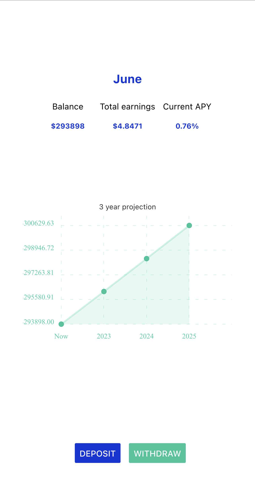

# DeFi Frontend iOS

Front end to interact with the DeFi infrastructure implemented in [DeFi Sandbox](https://github.com/s1ddhi/DeFiSandbox) through the backend created in [moonlight](https://github.com/s1ddhi/moonlight).

## Example Interface

Allows users to track balances and interest in terms of fiat (currently USD).

## Supported interactions

- Deposit request of $300
- Withdraw request of $100

Endpoints for deposit and withdraw requests support specific amounts so this can be simply extended.